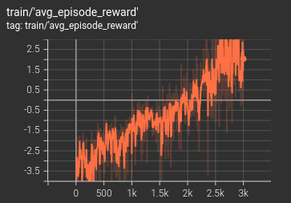

# Pytorch PPO implementation for both single-agent and multi-agent using RPC module

This repository provides a PyTorch implementation of Proximal Policy Optimization (PPO) 
for deep reinforcement learning (RL), where [Pytorch RPC module](https://pytorch.org/docs/stable/rpc.html) 
is applied for multiple environment runners.
This repository is tested in Python 3.10 under Ubuntu 22.04 LTS.


The repository includes examples for **single-agent** PPO training in environments 
like [Gymnasium](https://gymnasium.farama.org/index.html)’s ["CartPole-v1", "LunarLander-v3"] and 
**cooperative multi-agent environments** ["navigation", "road_traffic"] from 
[VMAS](https://github.com/proroklab/VectorizedMultiAgentSimulator). 
In cooperative multi-agent tasks, a centralized state is formed by concatenating the observations of all agents, 
with each agent’s individual reward guiding the learning process. 
This follows the Centralized Training with Distributed Execution (CTDE) scheme.


To train a PPO agent on a specific environment, 
set the --layout_index parameter to one of the following values: [0, 1, 2, 3]. 
Each index corresponds to an environment from the list ["CartPole-v1", "LunarLander-v3", "navigation", "road_traffic"]. 
For example, to run PPO for "CartPole-v1", navigate to the project folder and execute the following:
```
python main.py --layout_index=0
```


You can also set --only_evaluate=True to evaluate the training results, 
where a greedy action is selected instead of using the sampling strategy. For continuous action environments, 
the mean action will be used, while for discrete action environments, the argmax will be applied.


The training and testing records on Tensorboard including pre-trained model weights are saved in 
"/DemoResults/ppo/" folder categorized by the individual layout names. 


For the "road_traffic" environment, two
training settings are applied, where "is_testing_mode=True" (the episode continues if car collisions happen)
is saved in "/DemoResults/ppo/road_traffic_old" folder 
and "is_testing_mode=False" (the episode ends if car collisions happen) 
is saved in "/DemoResults/ppo/road_traffic" folder. During its evaluation, the episode step length is changed from
100 (used in training) to 1000.


This repository also supports multi-round training. If the initial training episode count is small, 
you can re-train the model starting from the last checkpoint, as demonstrated in the "road_traffic" environment.


The primary goal of this repository is not to achieve the best performance but to provide a simple and 
clear structure for understanding PPO algorithms.


## Sample evaluation results
The results after the training are shown as follows.
### Gym-CartPole-v1
|                          Gif                           |                        train                         |                        test                         |
|:------------------------------------------------------:|:----------------------------------------------------:|:---------------------------------------------------:|
|  |  |  |

### Gym-LunarLander-v3 continuous
|                            Gif                            |                          train                          |                          test                          |
|:---------------------------------------------------------:|:-------------------------------------------------------:|:------------------------------------------------------:|
|  |  |  |

### VMAS-navigation
|                          Gif                          |                        train                        |                        test                        |
|:-----------------------------------------------------:|:---------------------------------------------------:|:--------------------------------------------------:|
|  |  |  |

### VMAS-road_traffic
|                           Gif                           |                                                    train                                                     |                                   test                                    |
|:-------------------------------------------------------:|:------------------------------------------------------------------------------------------------------------:|:-------------------------------------------------------------------------:|
|  |  | .png) |
