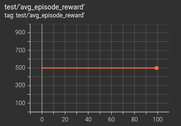

# Pytorch PPO implementation for both single-agent and multi-agent using RPC module

This repo is a Pytorch implementation for the proximal policy optimization (PPO) in deep reinforcement learning (RL),
where [Pytorch RPC module](https://pytorch.org/docs/stable/rpc.html) is applied for multiple environment runners.
This repo is run in Python 3.10 under Ubuntu 22.04LTS OS.

The example environments in this repo demonstrates the 
single agent PPO training for ["CartPole-v1", "LunarLander-v3"] 
from [Gymnasium](https://gymnasium.farama.org/index.html) and the **cooperative** multi-agent
["navigation", "road_traffic"]
from [VMAS](https://github.com/proroklab/VectorizedMultiAgentSimulator) environments. 
For cooperative multi-agent tasks, the centralized state from all agents' observations are concatenated for critic
networks by using its own reward to follow the centralized training with distributed execution (CTDE) scheme.


By setting "--layout_index" to one element from the list of "[0, 1, 2, 3]", 
it will train the PPO agent to learn for the corresponding
layout index shown in the list of "["CartPole-v1", "LunarLander-v3", "navigation", "road_traffic"]".
For example, to run the PPO for "CartPole-v1", 
after loading to this project folder, one can simply run the follows.
```
python main.py --layout_index=0
```

Also set --only_evaluate=True if you only want to evaluate the training results, where the greedy action will be 
selected instead of using sampling strategy (mean will be used for continuous action environments whereas 
the argmax will be applied in discrete action environments).


The training and testing records on Tensorboard including pre-trained model weights are saved in 
"/DemoResults/ppo/" folder with respect to the individual layout names. 


For the "road_traffic" environment, two
training settings are applied, where "is_testing_mode=True" (the episode continues if car collisions happen)
is saved in "/DemoResults/ppo/road_traffic_old" folder 
and "is_testing_mode=False" (the episode ends if car collisions happen) 
is saved in "/DemoResults/ppo/road_traffic" folder. During its evaluation, the episode step length is changed from
100 (training setting) to 1000.

This repo also supports multi-rounds of training. For example, if the training episode number is set small initially, 
then re-training the model from last training point is supported, which are demonstrated in "road_traffic" environment.


This repo is not aiming to achieve the best performance of the trained agent, but rather providing the simple
and clear coding structure to understand the PPO algorithms.

## Sample evaluation results
The results after the training are shown as follows.
### Gym-CartPole-v1
|                          Gif                           |                        train                         |                        test                         |
|:------------------------------------------------------:|:----------------------------------------------------:|:---------------------------------------------------:|
|  |  |  |

### Gym-LunarLander-v3 continuous
|                            Gif                            |                          train                          |                          test                          |
|:---------------------------------------------------------:|:-------------------------------------------------------:|:------------------------------------------------------:|
|  |  |  |

### VMAS-navigation
|                          Gif                          |                        train                        |                        test                        |
|:-----------------------------------------------------:|:---------------------------------------------------:|:--------------------------------------------------:|
|  |  |  |

### VMAS-road_traffic
|                           Gif                           |                                                    train                                                     |                                   test                                    |
|:-------------------------------------------------------:|:------------------------------------------------------------------------------------------------------------:|:-------------------------------------------------------------------------:|
|  |  | .png) |
